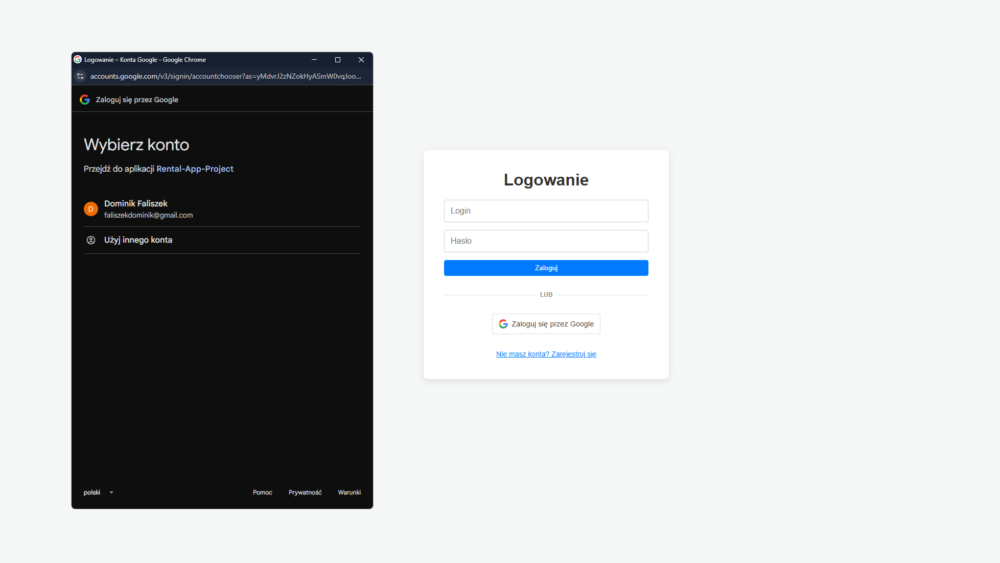
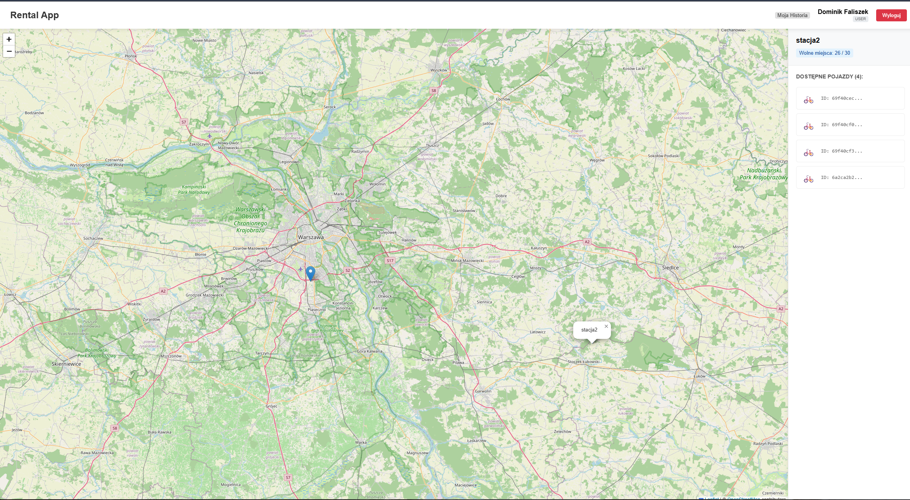
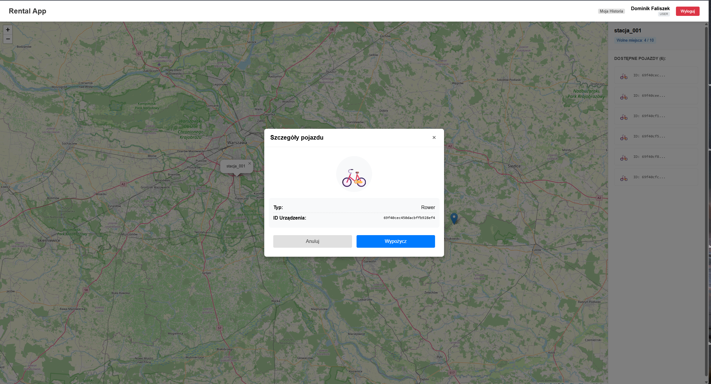
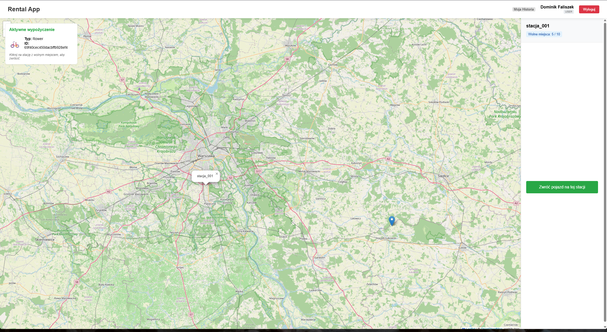
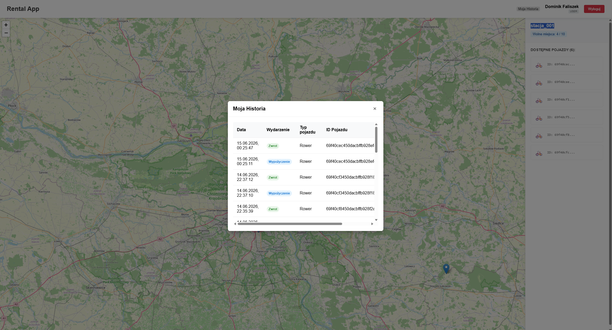
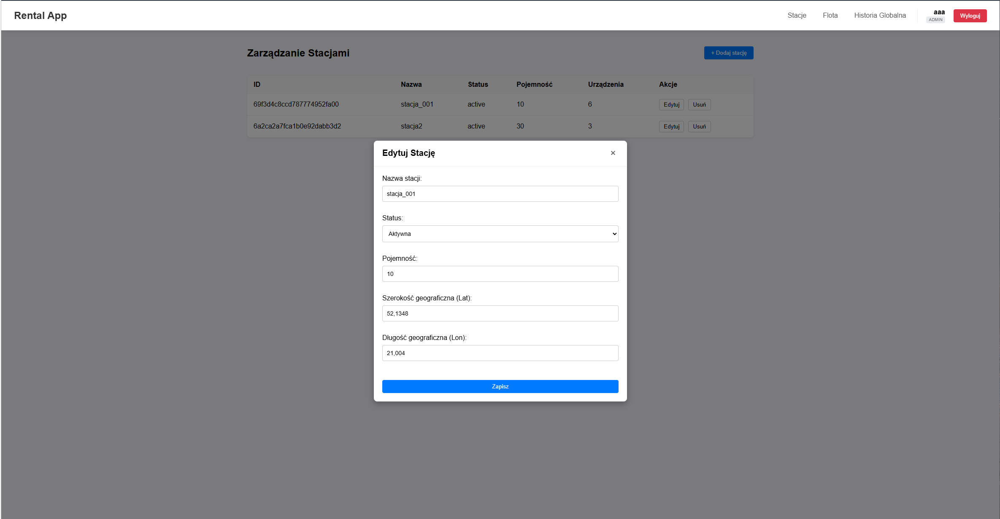
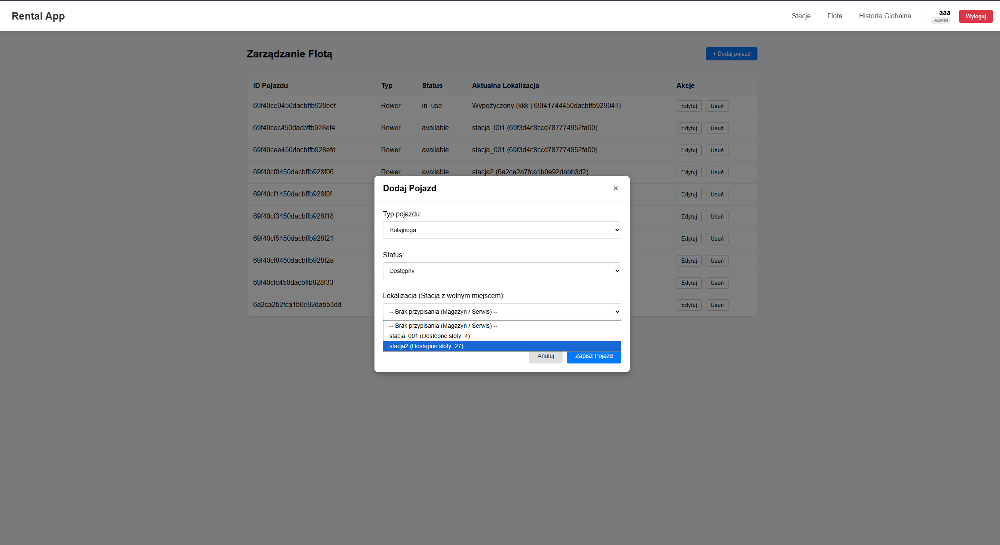
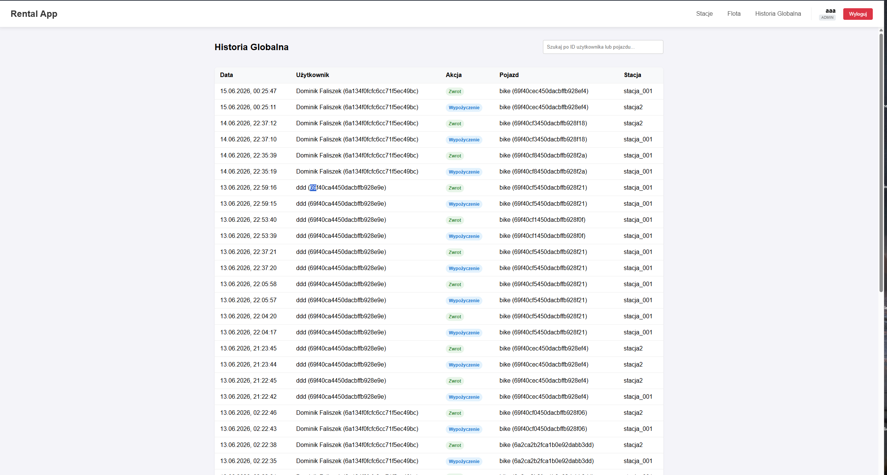

# System Zarządzania Wypożyczalnią Rowerów i Hulajnóg

Kompletna, pełnostosowa aplikacja webowa do zarządzania flotą pojazdów miejskich (rowery, hulajnogi) oraz siecią wirtualnych punktów postojowych (stacji bazowych). System został zaprojektowany z myślą o pełnym rozdzieleniu warstwy klienckiej (Frontend) i serwerowej (Backend), komunikując się wyłącznie za pośrednictwem bezpiecznej architektury REST API.

---

## 1. Cel i Zakres Projektu

Celem projektu było stworzenie działającej platformy realizującej pełne procesy obsługi wypożyczalni, z uwzględnieniem geolokalizacji, dynamicznego stanu zasobów, ścisłego podziału na role użytkowników (RBAC) oraz pełnej obserwowalności.

### Wykorzystany Stos Technologiczny:
- Frontend: React.js, Vite (bundler), TypeScript, CSS3, Leaflet (do renderowania map open-source).
- Backend: Express.js (Node.js), TypeScript, wbudowane middleware do metryk i logowania.
- Baza Danych: MongoDB (z Mongoose jako ODM - Object Data Modeling).
- Autoryzacja i Bezpieczeństwo: Custom JWT (JSON Web Tokens) oraz OAuth2 (Google Login).
- Jakość kodu i Testy: Jest, Supertest.
- Monitoring (DevOps): Prometheus (zbieranie metryk), Promtail & Loki (agregacja logów).

---

## 2. Opis Finalnych Funkcjonalności

System implementuje mechanizm RBAC (Role-Based Access Control), chroniący wybrane zasoby API za pomocą dedykowanych middleware, w zależności od poziomu uprawnień zalogowanego użytkownika (`user` lub `admin`).

### Rola: Użytkownik (User)
Głównym narzędziem użytkownika jest interaktywna mapa wyświetlająca stacje w czasie rzeczywistym.
- Autentykacja: Rejestracja i bezpieczne logowanie tradycyjne (login/hasło chronione JWT) oraz bezhasłowa integracja OAuth2 (Single Sign-On przez Google). System obsługuje również globalne przechwytywanie wygaśnięcia sesji (wylogowanie przy błędzie 401).
- Interaktywna Mapa (Leaflet): Podgląd lokalizacji wszystkich stacji bazowych (współrzędne `lat` / `lon`). Kliknięcie w znacznik stacji otwiera intuicyjny panel boczny z jej szczegółami.
- Wypożyczenia i Zwroty:
  - Przegląd dostępnej floty (lista urządzeń wraz z ID) zadokowanej na wybranej stacji.
  - Możliwość pobrania jednego wybranego pojazdu. Od tego momentu system blokuje (na poziomie bazy danych i interfejsu) możliwość jednoczesnego wypożyczenia kolejnego pojazdu.
  - Zmiana interfejsu podczas wypożyczenia (pływający panel aktywnego wynajmu).
- Zwrot posiadanego pojazdu na dowolnej stacji, pod warunkiem, że posiada ona wolne miejsca parkingowe (weryfikacja parametru `capacity` vs `device_count`).
- Historia Transakcji: Wgląd w osobisty dziennik wypożyczeń i zwrotów, prezentowany w estetycznej, modalnej tabeli (historia operacji).

### Rola: Administrator (Admin)
Administrator posiada dostęp do specjalnego wielozakładkowego panelu zarządzania (Admin Dashboard), umożliwiającego kontrolę nad całą infrastrukturą.
- Zarządzanie Stacjami: Moduł CRUD pozwalający na dodawanie nowych punktów na mapie (wymagane współrzędne), edycję ich pojemności, zmianę statusu (np. na stację wyłączoną z użytku) oraz bezpieczne usunięcie.
- Zarządzanie Flotą: Moduł CRUD dla pojazdów. Dodawanie nowych jednostek (określanie ich typu, np. `bike`, `scooter`), zmiana stanu technicznego (np. tryb serwisowy - `maintenance`) oraz wymuszona relokacja między stacjami bazowymi.
- Globalna Historia: Zaawansowany wgląd we wszystkie logi systemowe wygenerowane przez wszystkich użytkowników. Tabela umożliwia szybkie wyszukiwanie transakcji po identyfikatorze MongoDB konkretnego użytkownika lub pojazdu.

---

## 3. Instrukcja Uruchomienia

Projekt można uruchomić w dwóch trybach: Deweloperskim (z hot-reloadingiem) oraz Produkcyjnym (zoptymalizowanym).

### Wymagania Wstępne
- Node.js (v18 lub nowszy).
- MongoDB (działająca instancja lokalna lub klaster w chmurze MongoDB Atlas).

### Krok 1: Konfiguracja Serwera (Backend API)

Przejdź do katalogu serwera i zainstaluj pakiety:
`cd api`
`npm install`

Skonfiguruj środowisko: Skopiuj plik `.env.example` do pliku `.env`. Kluczowe parametry do uzupełnienia to:
- `PORT` - domyślnie 3100.
- `MONGO_URI` - ciąg połączeniowy do bazy danych.
- `JWT_SECRET` - losowy, bezpieczny ciąg znaków do podpisywania tokenów.

Uruchomienie (do wyboru):
- Tryb Deweloperski (Nodemon): `npm run dev` (serwer automatycznie zrestartuje się przy zmianach w kodzie).
- Tryb Produkcyjny: `npm run build` następnie `npm start`

### Krok 2: Konfiguracja Aplikacji Klienckiej (Frontend)
Skonfiguruj środowisko(opcjonalne - google auth): Skopiuj plik `.env.example` do pliku `.env`.
- dodaj `Identywikator klienta Oauth` na stronie `https://console.cloud.google.com/apis/credentials`
- wejdź w stworzonego klienta i dodaj adres fronendu do `Autoryzowane źródła JavaScriptu`
- uzupełnij `.env` o `Identyfikator klienta`, znajdujący się na tej samje stronie

W nowym oknie terminala przejdź do katalogu frontendu i zainstaluj pakiety:
`cd app`
`npm install`

Uruchomienie (do wyboru):
- Tryb Deweloperski: `npm run dev` (uruchamia Vite na porcie 5173 z modułem Hot-Module Replacement).
- Tryb Produkcyjny:
  `npm run build`
  `npm run preview`
  *Uwaga: W pliku `vite.config.ts` wymuszono uruchomienie serwera preview na porcie `5173`. Jest to niezbędne dla OAuth2 (ustaw na adres podany w Google JavaScript Origins).*

### Krok 3: Testowanie Automatyczne
Backend zawiera bogatą paletę testów integracyjnych (Jest + Supertest).
Aby uruchomić walidację reguł logiki biznesowej, z poziomu katalogu `api` wykonaj:
`npm test`

---

## 4. Architektura Danych i Relacje

System opiera się na 4 głównych kolekcjach dokumentów, łączonych za pomocą referencji MongoDB (Mongoose `ObjectId`):

Users: Przechowuje dane kont (login, hash hasła, rola `user`/`admin`, opcjonalny `googleId`) oraz referencję do aktualnie wypożyczonego urządzenia (`active_device`).

Stations: Przechowuje geolokalizację, status, maksymalną pojemność (`capacity`) oraz aktualny licznik zadokowanych pojazdów (`device_count`).

Devices: Przechowuje status techniczny oraz polimorficzną referencję (`binding_type`), wskazującą dynamicznie, czy pojazd jest obecnie zadokowany na `station` (id stacji), czy w posiadaniu `user` (id użytkownika).

History: Kolekcja logująca każdy punkt w czasie (timestamp). Zapisuje zdarzenie `RENT` lub `RETURN`, wiążąc ze sobą w jednym wpisie: `User`, `Device` oraz `Station`.

---

## 5. Zrzuty Ekranu Systemu (Demo)

| Ekran Logowania (OAuth2) | Interaktywna Mapa Stacji |
| :---: | :---: |
|  |  |

|         Okno Wypożyczania Urządzenia         |             Podczas wypożyczania              |                     Historia Użytkownika                      |
|:--------------------------------------------:|:---------------------------------------------:|:-------------------------------------------------------------:|
|  |  |  |

| Panel Admina - Widok 1 | Panel Admina - Widok 2 | Panel Admina - Widok 3 |
| :---: | :---: | :---: |
|  |  |  |

## 6. Zintegrowany Monitoring i Logowanie

Projekt posiada skonfigurowany katalog `api/monitoring/` zawierający pliki konfiguracyjne dla zewnętrznych usług obserwowalności (szczegóły w `/docs/monitoring.md`):
- Prometheus (`prometheus.yml`): Odpowiada za scraping metryk wydajnościowych (czas odpowiedzi endpointów, użycie procesora/pamięci) wystawionych przez middleware backendowe.
- Loki & Promtail (`loki-config.yaml`, `promtail-config.yaml`): Służą do agregacji, filtrowania i przechowywania scentralizowanych logów aplikacyjnych generowanych przez `utils/logger.ts`.

---

## 7. Znane Ograniczenia

W bieżącej wersji systemu udokumentowano następujące zachowania i ograniczenia:

1. Statyczna synchronizacja stanu: Architektura opiera się wyłącznie na żądaniach HTTP REST (pull-based). Zmiany stanu stacji (np. wypożyczenie roweru przez kogoś innego) nie są automatycznie wypychane do innych klientów na żywo. Aktualizacja widoku dostępności wymaga ręcznej interakcji użytkownika (ponowne kliknięcie w znacznik stacji lub odświeżenie strony). System nie posiada warstwy WebSockets.

2. Zabezpieczenie kaskadowe stacji: Mechanizmy walidacyjne zapobiegają usunięciu stacji bazowej przez Administratora, dopóki znajdują się na niej jakiekolwiek pojazdy (`device_count > 0`). Aby usunąć stację, Administrator musi najpierw ręcznie "przenieść" (edytować relacje) wszystkie przypisane urządzenia na inne stacje w panelu zarządzania Flotą.

3. Brak usuwania kont

### Reszta dokumentacji projektu znajduje się w folderze `docs/`:
* [Założenia projektowe](./docs/topic-selection.md)
* [Założenia/opis interfejsu](./docs/ui.md)
* [Diagram związków encji (ERD)](./docs/ERD.png)
* [Diagram przypadków użycia](./docs/UseCase.png)
* [Szczegóły dotyczące monitoringu](./docs/monitoring.md)
* [Przykłady i opis API](./docs/api.md)